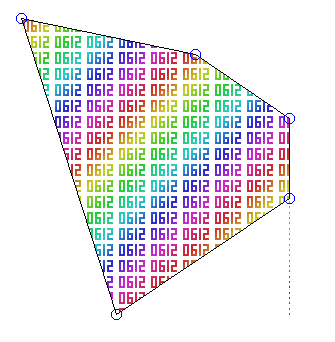

# JLU_CG_LAB

 JLU 计算机图形学实验

作者：GGN\_2015

环境：Visual Studio 2022 - MFC - C ++ v143

## 重要的事情说三遍

- **抄袭可耻，自己动手丰衣足食**
- **抄袭可耻，自己动手丰衣足食**
- **抄袭可耻，自己动手丰衣足食**

## CG0-

实现了控制点的增加删除和移动，是所有其他项目的基础。

## CG1-

利用控制点绘制圆和椭圆。

遇到的问题：起初的时候选择画笔 CPen 怎么也不能修改绘制的颜色，后来发现是 CreateCompatibleBitmap 时使用了错误的 dc 作为参数。

正确的写法：

```cpp
CDC dc;
dc.CreateCompatibleDC(pDC);
CBitmap memBmp;
memBmp.CreateCompatibleBitmap(pDC, zcRect.Width(),
                              zcRect.Height()); /* 这里不能用 &dc */
CBitmap* OldBmp = dc.SelectObject(&memBmp);
```

错误的写法：

```cpp
CDC dc;
dc.CreateCompatibleDC(pDC);
CBitmap memBmp;
memBmp.CreateCompatibleBitmap(&dc, zcRect.Width(),
							zcRect.Height()); /* 这里不能用 &dc */
CBitmap* OldBmp = dc.SelectObject(&memBmp);
```

## CG2-

多边形扫描转换的边填充算法。

遇到的问题：

1. 起初采用的算法是对每个线段 AB 考虑起始点 A 而不考虑结束点 B，发现在极值点处出现了泄露的问题，对每个极值点对应的那条扫描线多取反一次即可（后来在实现 CG4 时进一步修正了这个问题 ）；
2. 填充绘制很慢，会导致在拖动控制点时发生卡顿，因此我直接规定在鼠标按下时不进行填充渲染；

## CG3-

GetDC 后要 ReleaseDC 而不是 DeleteDC（DeleteDC 用于销毁一个 DC）。

单纯使用 KeyDown 事件无法实现多键同时按下的控制，改用 GetAsyncKeyState 实现。

自动旋转的小正方体不能自动绘制，需要设置定时器触发绘制。

要将 SetTimer 放到 OnInitialUpdate 中执行，而不要放到构造函数中执行（此时窗口初始化未完成），否则无法正常执行。

角度计算错误导致填充出错（留几张搞笑的图）：


## CG4-

实现了矩形区域的裁剪算法。

遇到的问题：

1. 错用了 nodeId 于 m\_NodeMap[nodeId] 导致裁剪出错；
2. 由于裁剪能够得到十分整齐的边缘，发现了 CG2- 的极值点处理不够完美，会在整齐边缘出错，修改了取等条件即可。

错误的写法：

```cpp
/* 极值点 */
if (lastPos.x < nowPos.x && nextPos.x < nowPos.x ||
    lastPos.x > nowPos.x && nextPos.x > nowPos.x) {
    buffer[nowPos.x - topleft.x][nowPos.y - topleft.y] ^= 1;
}
```

正确的写法：

```cpp
/* 极值点 */
if (lastPos.x <= nowPos.x && nextPos.x < nowPos.x ||
    lastPos.x >= nowPos.x && nextPos.x > nowPos.x) {
    buffer[nowPos.x - topleft.x][nowPos.y - topleft.y] ^= 1;
}
```



错误效果如上图所示，正确的做法不存在泄露问题。

